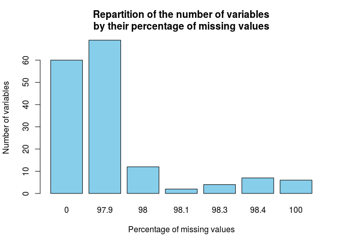
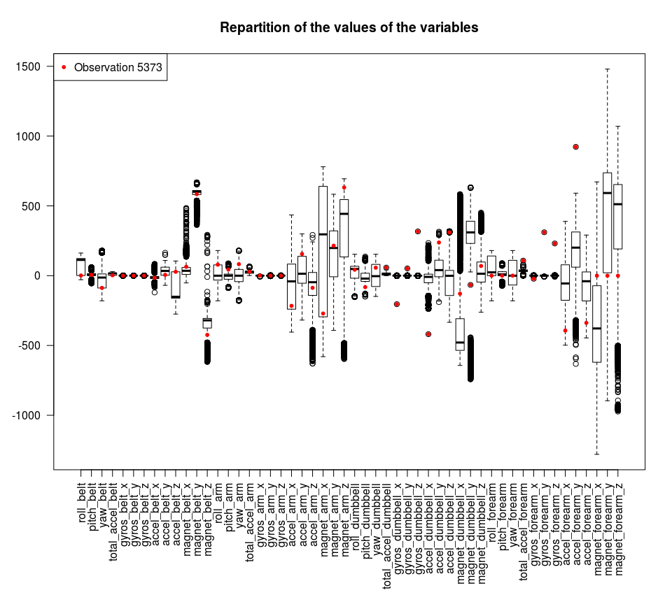
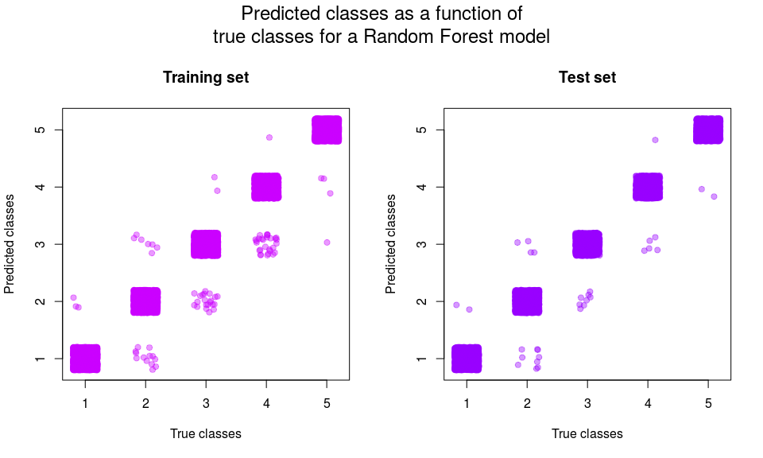

# Practical Machine Learning Project
Morgane Flauder  
January 28, 2016  

# Recognition of different types of mistakes during weight lifting exercises

This project is an assignment for the course Practical Machine Learning (Johns Hopkins University) on Coursera. The data used is from accelerometers on the belt, forearm, arm, and dumbell of 6 participants of a study. They were asked to perform barbell lifts correctly and incorrectly in 5 different ways :

- A : exactly according to the specification,
- B : throwing the elbows to the front,
- C : lifting the dumbbell only halfway,
- D : lowering the dumbbell only halfway,
- E : throwing the hips to the front.

The goal is to predict the way the exercise was done. Tha data come from the [Weight Lifting Exercises Dataset](http://groupware.les.inf.puc-rio.br/har#weight_lifting_exercises).

## Data Cleaning

### Dealing with missing values

First, let's check if there are any missing values in order to remove them.


```r
# Reading the data
data <- read.csv("pml-training.csv", 
                 na.strings = c("NA", "#DIV/0!", ""))

# Creation of an empty vector labelled by the variable names
vec_na <- vector(length = dim(data)[2])
names(vec_na) <- names(data)

# Computation of the percentage of missing values for each variable
for (i in 1:dim(data)[2]) {
    percent_na_i <- round((sum(is.na(data[[names(vec_na[i])]])) / dim(data)[1]) * 100, 
                          digits = 1)
    vec_na[i] <- percent_na_i
}

# Visualization
barplot(table(vec_na),
        main = "Repartition of the number of variables\nby their percentage of missing values",
        xlab = "Percentage of missing values",
        ylab = "Number of variables",
        col = "skyblue")
```

\

We can see that the majority of variables have more than 97% of missing values. We are going to keep the 60 other variables for our model.


```r
# Removing variables with more than 90% NAs
na_var <- names(vec_na[vec_na > 90])
for (i in 1:length(na_var)) {
    data[[na_var[i]]] <- NULL
}
```

Some other variables have no predictive power, for example the user name or the timestamp, so we are going to remove them too.


```r
data[["X"]] <- NULL
data[["user_name"]] <- NULL

data[["raw_timestamp_part_1"]] <- NULL
data[["raw_timestamp_part_2"]] <- NULL
data[["cvtd_timestamp"]] <- NULL

data[["new_window"]] <- NULL
data[["num_window"]] <- NULL

dim(data)[2]
```

```
## [1] 53
```

We can see that we have now 53 variables : the outcome, `classe`, and 52 predictive variables.

### Subsetting the data

We are now going to work on a subset (60%) of the original dataset, called `train`. The rest, called `test`, will be used to compute the out of sample error after choosing a model. I did this in order to do a test set validation (a type of cross-validation).


```r
suppressPackageStartupMessages(library(caret))
set.seed(65656)

in_training <- createDataPartition(data$classe, p = 0.6, list = FALSE)
train <- data[in_training,]
test <- data[-in_training,]
```

After some visualization, I noticed the presence of an outlier : the variable `gyros_dumbbell_x` takes values between -1.99 and 2.22, except for a value at -204. Let's check this specific observation.


```r
par(mar = c(10,4,4,2))

boxplot(train[,1:52], 
        las = 2,
        main = "Repartition of the values of the variables")
points(1:52, 
       train[train$gyros_dumbbell_x == -204,1:52], 
       col = "red", 
       pch = 20)
legend("topleft",
       legend = "Observation 5373",
       pch = 20,
       col = "red")
```

\

We can see that for this observation, many values seem off, for example in the gyroscopic measures of the dumbbell or the forearm. I assumed that the measurement device malfunctionned and I chose to remove this observation from the training test.


```r
train <- train[train$gyros_dumbbell_x != -204,] 
```

## Model creation and selection

### SVM

I started with a Support Vector Machine (SVM) model, known for its efficacy. I used the 52 variables previously selected to fit the model on the training set.


```r
library(e1071)

fit_svm <- svm(classe ~ ., data = train)

confusionMatrix(predict(fit_svm), train$classe)$overall[1]
```

```
##  Accuracy 
## 0.9522718
```

The SVM model has an accuracy of 95.2% on the training set. 

### Random Forest

Then, I chose to create a Random Forest model.


```r
suppressPackageStartupMessages(library(randomForest))

fit_rf <- randomForest(classe ~ ., data = train)

confusionMatrix(predict(fit_rf), train$classe)
```

```
## Confusion Matrix and Statistics
## 
##           Reference
## Prediction    A    B    C    D    E
##          A 3344   13    0    0    0
##          B    3 2259   21    0    0
##          C    0    7 2031   28    1
##          D    0    0    2 1901    3
##          E    0    0    0    1 2161
## 
## Overall Statistics
##                                           
##                Accuracy : 0.9933          
##                  95% CI : (0.9916, 0.9947)
##     No Information Rate : 0.2842          
##     P-Value [Acc > NIR] : < 2.2e-16       
##                                           
##                   Kappa : 0.9915          
##  Mcnemar's Test P-Value : NA              
## 
## Statistics by Class:
## 
##                      Class: A Class: B Class: C Class: D Class: E
## Sensitivity            0.9991   0.9912   0.9888   0.9850   0.9982
## Specificity            0.9985   0.9975   0.9963   0.9995   0.9999
## Pos Pred Value         0.9961   0.9895   0.9826   0.9974   0.9995
## Neg Pred Value         0.9996   0.9979   0.9976   0.9971   0.9996
## Prevalence             0.2842   0.1935   0.1744   0.1639   0.1839
## Detection Rate         0.2840   0.1918   0.1725   0.1614   0.1835
## Detection Prevalence   0.2851   0.1939   0.1755   0.1619   0.1836
## Balanced Accuracy      0.9988   0.9943   0.9925   0.9922   0.9990
```

The accuracy of the Random Forest model is better : 99.2% on the training set.

I chose to keep this last model. The next step is to compute the out of sample error, which is *1 - accuracy* (cross-validation).


```r
1 - confusionMatrix(predict(fit_rf, test), test$classe)$overall[1]
```

```
##    Accuracy 
## 0.003951058
```

The out of sample error is 0.0040, or 0.40% of errors in the test set.

To visualize the predictions of this model, I chose to plot the confusion matrixes for the training and test sets (in other words, the true classes versus the classes predicted by the model). Since the points would overlap, I used the function `jitter` to add a small amount of noise and be able to visualize the points.


```r
par(mfrow = c(1,2), oma = c(0, 0, 3, 0))

# Plot for the training set
plot(jitter(as.numeric(train$classe)), 
     jitter(as.numeric(predict(fit_rf))), 
     col = rgb(0.8, 0, 1, 0.4), 
     pch = 19,
     main = "Training set",
     xlab = "True classes",
     ylab = "Predicted classes")

# Plot for the test set
plot(jitter(as.numeric(test$classe)), 
     jitter(as.numeric(predict(fit_rf, test))), 
     col = rgb(0.6, 0, 1, 0.4), 
     pch = 19,
     main = "Test set",
     xlab = "True classes",
     ylab = "Predicted classes")

# Title
mtext("Predicted classes as a function of\ntrue classes for a Random Forest model", 
      outer = TRUE,
      cex = 1.5)
```

\

As we can see, most of the classes are correctly predicted.

## Conclusion

I was able to fit a very successful model in order to predict the classes of weight lifting exercises. I found that the best model was a Random Forest model with and accuracy of 99.6% on the test set. I was able to verify the success of this model on a supplementary dataset of 20 observations. All the classes were predicted correctly, which confirms the efficacy of this model.


