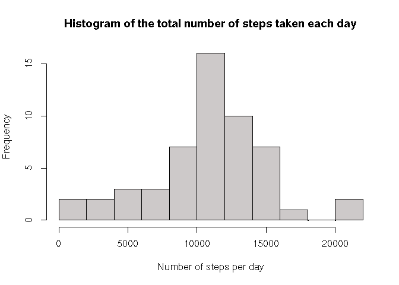
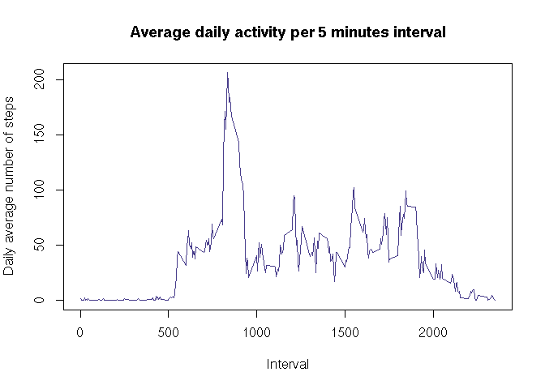
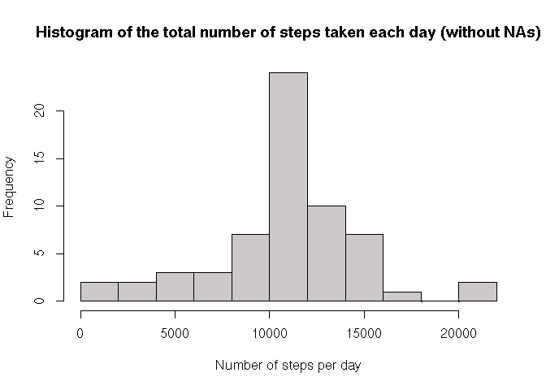
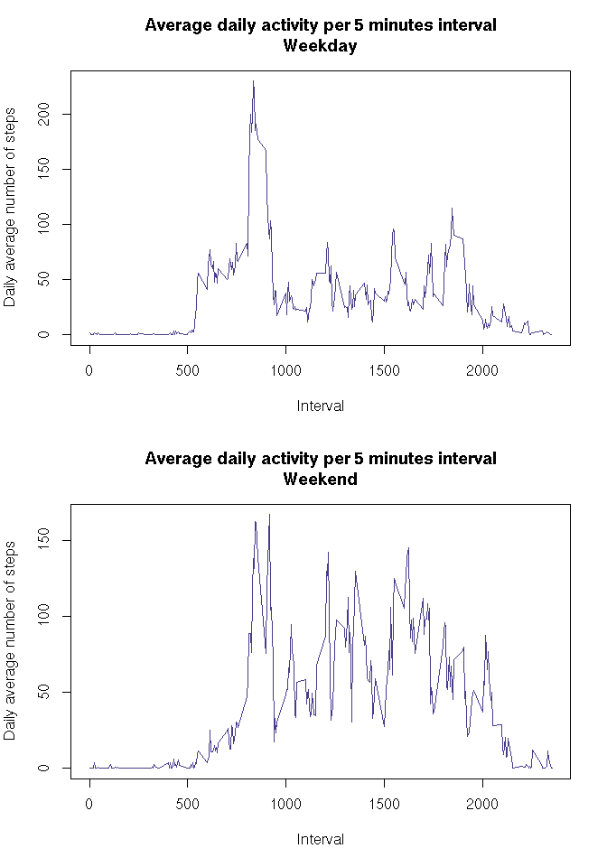

# Reproducible Research: Peer Assessment 1


## Loading and preprocessing the data

First, we load the document using read.csv(), then we convert the date variable
in the date format.


```r
data <- read.csv("activity.csv")
data$date <- as.Date(data$date)
```


## What is mean total number of steps taken per day?

First, let's compute the total number of steps taken each day.


```r
stepsPerDay <- by(data$steps, data$date, sum)
print(stepsPerDay)
```

```
## data$date: 2012-10-01
## [1] NA
## -------------------------------------------------------- 
## data$date: 2012-10-02
## [1] 126
## -------------------------------------------------------- 
## data$date: 2012-10-03
## [1] 11352
## -------------------------------------------------------- 
## data$date: 2012-10-04
## [1] 12116
## -------------------------------------------------------- 
## data$date: 2012-10-05
## [1] 13294
## -------------------------------------------------------- 
## data$date: 2012-10-06
## [1] 15420
## -------------------------------------------------------- 
## data$date: 2012-10-07
## [1] 11015
## -------------------------------------------------------- 
## data$date: 2012-10-08
## [1] NA
## -------------------------------------------------------- 
## data$date: 2012-10-09
## [1] 12811
## -------------------------------------------------------- 
## data$date: 2012-10-10
## [1] 9900
## -------------------------------------------------------- 
## data$date: 2012-10-11
## [1] 10304
## -------------------------------------------------------- 
## data$date: 2012-10-12
## [1] 17382
## -------------------------------------------------------- 
## data$date: 2012-10-13
## [1] 12426
## -------------------------------------------------------- 
## data$date: 2012-10-14
## [1] 15098
## -------------------------------------------------------- 
## data$date: 2012-10-15
## [1] 10139
## -------------------------------------------------------- 
## data$date: 2012-10-16
## [1] 15084
## -------------------------------------------------------- 
## data$date: 2012-10-17
## [1] 13452
## -------------------------------------------------------- 
## data$date: 2012-10-18
## [1] 10056
## -------------------------------------------------------- 
## data$date: 2012-10-19
## [1] 11829
## -------------------------------------------------------- 
## data$date: 2012-10-20
## [1] 10395
## -------------------------------------------------------- 
## data$date: 2012-10-21
## [1] 8821
## -------------------------------------------------------- 
## data$date: 2012-10-22
## [1] 13460
## -------------------------------------------------------- 
## data$date: 2012-10-23
## [1] 8918
## -------------------------------------------------------- 
## data$date: 2012-10-24
## [1] 8355
## -------------------------------------------------------- 
## data$date: 2012-10-25
## [1] 2492
## -------------------------------------------------------- 
## data$date: 2012-10-26
## [1] 6778
## -------------------------------------------------------- 
## data$date: 2012-10-27
## [1] 10119
## -------------------------------------------------------- 
## data$date: 2012-10-28
## [1] 11458
## -------------------------------------------------------- 
## data$date: 2012-10-29
## [1] 5018
## -------------------------------------------------------- 
## data$date: 2012-10-30
## [1] 9819
## -------------------------------------------------------- 
## data$date: 2012-10-31
## [1] 15414
## -------------------------------------------------------- 
## data$date: 2012-11-01
## [1] NA
## -------------------------------------------------------- 
## data$date: 2012-11-02
## [1] 10600
## -------------------------------------------------------- 
## data$date: 2012-11-03
## [1] 10571
## -------------------------------------------------------- 
## data$date: 2012-11-04
## [1] NA
## -------------------------------------------------------- 
## data$date: 2012-11-05
## [1] 10439
## -------------------------------------------------------- 
## data$date: 2012-11-06
## [1] 8334
## -------------------------------------------------------- 
## data$date: 2012-11-07
## [1] 12883
## -------------------------------------------------------- 
## data$date: 2012-11-08
## [1] 3219
## -------------------------------------------------------- 
## data$date: 2012-11-09
## [1] NA
## -------------------------------------------------------- 
## data$date: 2012-11-10
## [1] NA
## -------------------------------------------------------- 
## data$date: 2012-11-11
## [1] 12608
## -------------------------------------------------------- 
## data$date: 2012-11-12
## [1] 10765
## -------------------------------------------------------- 
## data$date: 2012-11-13
## [1] 7336
## -------------------------------------------------------- 
## data$date: 2012-11-14
## [1] NA
## -------------------------------------------------------- 
## data$date: 2012-11-15
## [1] 41
## -------------------------------------------------------- 
## data$date: 2012-11-16
## [1] 5441
## -------------------------------------------------------- 
## data$date: 2012-11-17
## [1] 14339
## -------------------------------------------------------- 
## data$date: 2012-11-18
## [1] 15110
## -------------------------------------------------------- 
## data$date: 2012-11-19
## [1] 8841
## -------------------------------------------------------- 
## data$date: 2012-11-20
## [1] 4472
## -------------------------------------------------------- 
## data$date: 2012-11-21
## [1] 12787
## -------------------------------------------------------- 
## data$date: 2012-11-22
## [1] 20427
## -------------------------------------------------------- 
## data$date: 2012-11-23
## [1] 21194
## -------------------------------------------------------- 
## data$date: 2012-11-24
## [1] 14478
## -------------------------------------------------------- 
## data$date: 2012-11-25
## [1] 11834
## -------------------------------------------------------- 
## data$date: 2012-11-26
## [1] 11162
## -------------------------------------------------------- 
## data$date: 2012-11-27
## [1] 13646
## -------------------------------------------------------- 
## data$date: 2012-11-28
## [1] 10183
## -------------------------------------------------------- 
## data$date: 2012-11-29
## [1] 7047
## -------------------------------------------------------- 
## data$date: 2012-11-30
## [1] NA
```

Here is the histogram of the total number of steps taken each day.


```r
hist(stepsPerDay, 
     breaks=10, 
     main="Histogram of the total number of steps taken each day",
     xlab="Number of steps per day", 
     col="snow3")
```

 

Let's compute the mean and the median of the number of steps taken each day.


```r
meanSteps <- mean(stepsPerDay, na.rm=T)
print(meanSteps)
```

```
## [1] 10766.19
```


```r
medianSteps <- median(stepsPerDay, na.rm=T)
print(medianSteps)
```

```
## [1] 10765
```


## What is the average daily activity pattern?

First, let's compute the average number of steps per interval, then let's
draw the plot of the average daily activity.


```r
meanPerInterval <- by(data$steps, data$interval, mean, na.rm=T)
plot(x = data$interval[1:288], 
     y = meanPerInterval, 
     type = "l", 
     main = "Average daily activity per 5 minutes interval", 
     xlab = "Interval", 
     ylab = "Daily average number of steps", 
     col="slateblue4")
```

 

We search for the index of meanPerInterval where the value is the maximum.


```r
indexMaxMean <- match(max(meanPerInterval), meanPerInterval)
meanPerInterval[indexMaxMean]
```

```
##      835 
## 206.1698
```

The 5-minute interval, on average across all the days in the dataset, that contains the maximum number of steps is the interval 
835. The average number of steps in this interval
is 206.1698113 steps.

## Imputing missing values

First, we compute the number of missing values in the dataset.


```r
sum(is.na(data$steps))
```

```
## [1] 2304
```

There are 2304 missing values in this dataset.

We are now going to fill the missing values. All the missing values 
will be replaced by the average number of steps corresponding to that time interval.


```r
# Converting meanPerInterval in a dataframe
names_meanPerInterval <- names(meanPerInterval)
meanPerInterval <- data.frame(rbind(meanPerInterval))
colnames(meanPerInterval) <- names_meanPerInterval

# Initializing dataFill (= data without NAs)
dataFill <- data
for (i in 1:dim(dataFill)[1]) {
      if (is.na(dataFill$steps[i])) {
            dataFill$steps[i] <- meanPerInterval[[toString(dataFill$interval[i])]]
      }
}
```


Then, we make a histogram of the total number of steps taken each day.


```r
stepsPerDayFill <- by(dataFill$steps, dataFill$date, sum)
hist(stepsPerDayFill, 
     breaks=10, 
     main="Histogram of the total number of steps taken each day (without NAs)",
     xlab="Number of steps per day", 
     col="snow3")
```

 

Let's compute the mean and the median of the number of steps taken each day, this
time without the NAs.


```r
meanStepsFill <- mean(stepsPerDayFill)
print(meanSteps)
```

```
## [1] 10766.19
```


```r
medianStepsFill <- median(stepsPerDayFill)
print(medianSteps)
```

```
## [1] 10765
```

Now, let's compute the difference between the mean and the median with and without
NAs.


```r
meanStepsFill - meanSteps
```

```
## [1] 0
```


```r
as.numeric(medianStepsFill) - medianSteps
```

```
## [1] 1.188679
```

We can see that there is no difference. The average number of steps taken per
day is the same with and without the missing values. However, filling the missing
values did change something : the frequency of the mean value went up. To explain
this, let's have a look at the missing values.


```r
str(split(data[is.na(data$steps),], data[is.na(data$steps),]$date))
```

```
## List of 8
##  $ 2012-10-01:'data.frame':	288 obs. of  3 variables:
##   ..$ steps   : int [1:288] NA NA NA NA NA NA NA NA NA NA ...
##   ..$ date    : Date[1:288], format: "2012-10-01" ...
##   ..$ interval: int [1:288] 0 5 10 15 20 25 30 35 40 45 ...
##  $ 2012-10-08:'data.frame':	288 obs. of  3 variables:
##   ..$ steps   : int [1:288] NA NA NA NA NA NA NA NA NA NA ...
##   ..$ date    : Date[1:288], format: "2012-10-08" ...
##   ..$ interval: int [1:288] 0 5 10 15 20 25 30 35 40 45 ...
##  $ 2012-11-01:'data.frame':	288 obs. of  3 variables:
##   ..$ steps   : int [1:288] NA NA NA NA NA NA NA NA NA NA ...
##   ..$ date    : Date[1:288], format: "2012-11-01" ...
##   ..$ interval: int [1:288] 0 5 10 15 20 25 30 35 40 45 ...
##  $ 2012-11-04:'data.frame':	288 obs. of  3 variables:
##   ..$ steps   : int [1:288] NA NA NA NA NA NA NA NA NA NA ...
##   ..$ date    : Date[1:288], format: "2012-11-04" ...
##   ..$ interval: int [1:288] 0 5 10 15 20 25 30 35 40 45 ...
##  $ 2012-11-09:'data.frame':	288 obs. of  3 variables:
##   ..$ steps   : int [1:288] NA NA NA NA NA NA NA NA NA NA ...
##   ..$ date    : Date[1:288], format: "2012-11-09" ...
##   ..$ interval: int [1:288] 0 5 10 15 20 25 30 35 40 45 ...
##  $ 2012-11-10:'data.frame':	288 obs. of  3 variables:
##   ..$ steps   : int [1:288] NA NA NA NA NA NA NA NA NA NA ...
##   ..$ date    : Date[1:288], format: "2012-11-10" ...
##   ..$ interval: int [1:288] 0 5 10 15 20 25 30 35 40 45 ...
##  $ 2012-11-14:'data.frame':	288 obs. of  3 variables:
##   ..$ steps   : int [1:288] NA NA NA NA NA NA NA NA NA NA ...
##   ..$ date    : Date[1:288], format: "2012-11-14" ...
##   ..$ interval: int [1:288] 0 5 10 15 20 25 30 35 40 45 ...
##  $ 2012-11-30:'data.frame':	288 obs. of  3 variables:
##   ..$ steps   : int [1:288] NA NA NA NA NA NA NA NA NA NA ...
##   ..$ date    : Date[1:288], format: "2012-11-30" ...
##   ..$ interval: int [1:288] 0 5 10 15 20 25 30 35 40 45 ...
```

We can see that the missing values were for 8 full days. Since we
replace them with mean values by time interval, we artificially created 8 "average days". These averages days are added to the frequency, so we have 8 more average days now.


## Are there differences in activity patterns between weekdays and weekends?

First, let's add a new variable "weekDays", which has 2 factors : weekend or
weekday.


```r
dayOfTheWeek <- function(date) {
      if (weekdays(date)=="Sunday" || weekdays(date)=="Saturday") { 
            return("weekend")
      } else {
            return("weekday")
      }
}

dataFill$weekDays <- mapply(dayOfTheWeek, dataFill$date)
```

Let's plot the number of steps depending on the day of the week (weekend or weekday).


```r
# Creating 2 dataframes : one for the weekend, one for the weekdays
dataFillSplit <-split(dataFill, dataFill$weekDays)
dataFill$weekDays <- as.factor(dataFill$weekDays)
dataFillWeekend <- dataFillSplit$weekend
dataFillWeekday <- dataFillSplit$weekday

# Computing the average number of steps per interval for each dataframe
meanPerIntervalFillWeekend <- by(dataFillWeekend$steps, 
                                 dataFillWeekend$interval, 
                                 mean)

meanPerIntervalFillWeekday <- by(dataFillWeekday$steps, 
                                 dataFillWeekday$interval, 
                                 mean)

# Plots
par(mfrow=c(2,1))

plot(x = dataFill$interval[1:288], 
     y = meanPerIntervalFillWeekday, 
     type = "l", 
     main = "Average daily activity per 5 minutes interval\nWeekday",
     xlab = "Interval", 
     ylab = "Daily average number of steps", 
     col="slateblue4")

plot(x = dataFill$interval[1:288], 
     y = meanPerIntervalFillWeekend, 
     type = "l", 
     main = "Average daily activity per 5 minutes interval\nWeekend", 
     xlab = "Interval", 
     ylab = "Daily average number of steps", 
     col="slateblue4")
```

 


On weekdays, the person seems to have a routine : there are clear spikes of
activity at the same time each day. The most important spike is at the beginning of the day. On the weekend, this spike doesn't appear, so maybe this perso walks to go to work each morning. 


